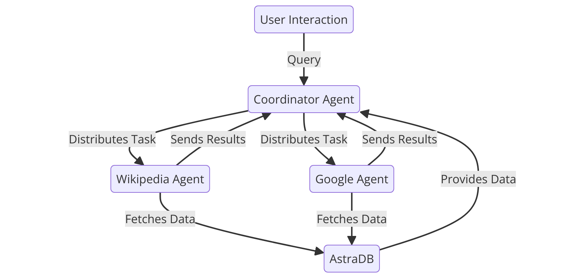

# **Multi-Agent Chatbot Application**
> An AI-driven chatbot system leveraging multi-agent architecture to provide accurate, flexible, and context-aware responses.

---

## **Overview**
This project addresses the limitations of traditional chatbots by introducing a multi-agent architecture that integrates specialized agents for real-time data retrieval and response synthesis. Built with **LangGraph**, **AstraDB**, and **Streamlit**, this chatbot ensures modularity, scalability, and efficiency.

---

## **Features**
- **Multi-Agent System**: Combines Wikipedia and Google agents for accurate and real-time information retrieval.
- **Coordinator Agent**: Orchestrates task distribution and response integration across agents.
- **AstraDB Integration**: Stores conversation history, preferences, and validated knowledge for enhanced performance.
- **Streamlit Interface**: Provides a user-friendly interface for interaction.

---

## **Architecture**


The system comprises:
1. **User Interaction**: Users initiate queries via a Streamlit interface.
2. **Coordinator Agent**: Manages information flow between agents.
3. **Wikipedia Agent**: Fetches factual data from Wikipedia.
4. **Google Agent**: Retrieves real-time data using the Google Search API.
5. **AstraDB**: Stores and retrieves conversation history and validated responses.

---

## **Workflow**
1. User enters a query via the Streamlit interface.
2. Coordinator Agent routes the query to appropriate agents.
3. Agents (Wikipedia, Google) fetch relevant data.
4. Coordinator Agent synthesizes the data.
5. Response is sent to the user and stored in AstraDB for future use.

---

## **Tech Stack**
- **LangGraph**: Represents workflows as graphs to streamline agent interactions.
- **AstraDB**: A cloud-native NoSQL database for scalable data storage.
- **Streamlit**: Framework for building the user interface.
- **Wikipedia API**: Fetches factual information.
- **Google API**: Retrieves up-to-date search results.

---

## **How to Run**
### **Prerequisites**
- Python 3.8+
- Virtual Environment (optional but recommended)

### **Installation**
1. Clone the repository:
   ```bash
   git clone https://github.com/your-username/multi-agent-chatbot.git
   cd multi-agent-chatbot

2. Install dependencies:
   ```bash
   pip install -r requirements.txt

3. Set up environment variables:
    Create a .env file and add:
    ```bash
   TOGETHER_API_KEY=your_together_api_key
   GOOGLE_API_KEY=your_google_api_key

4. Run the application
   ```bash
   streamlit run app.py


## **Future Enhancements**

	•	Add more specialized agents for different data types.
	•	Implement advanced validation using third-party fact-checking APIs.
	•	Explore integration with LLMs like OpenAI’s GPT for better context understanding.

Contributors

	•	Atharva Weginwar
	•	LinkedIn: [in/atharvaweginwar/](https://www.linkedin.com/in/atharvaweginwar/)
	•	Yash Patil
	•	LinkedIn: [in/yashpatil23/](https://www.linkedin.com/in/yashpatil23/)
